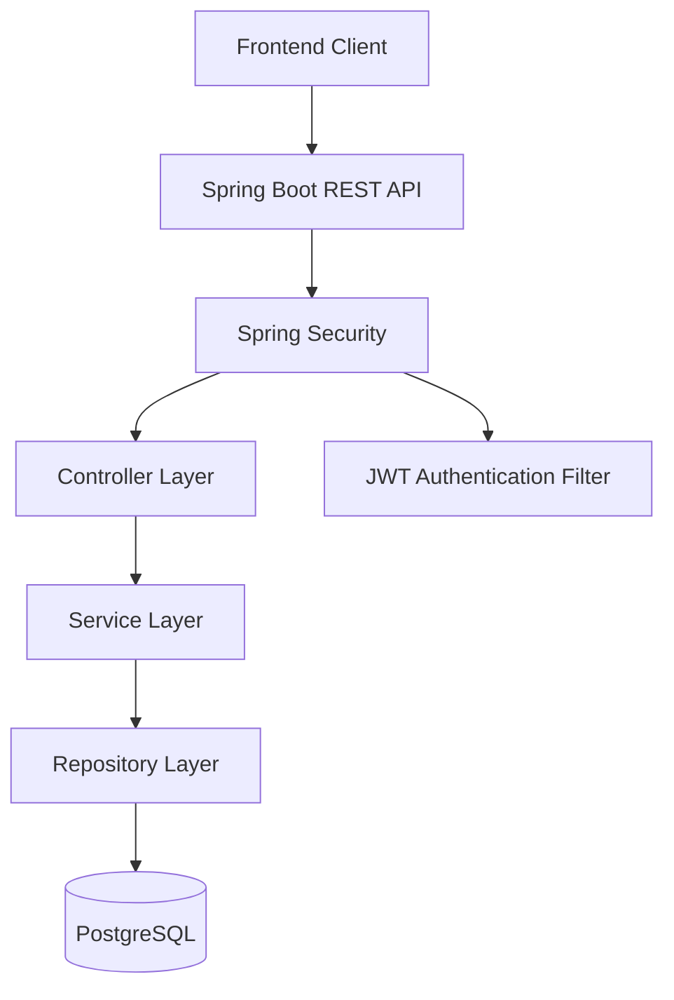
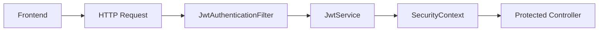
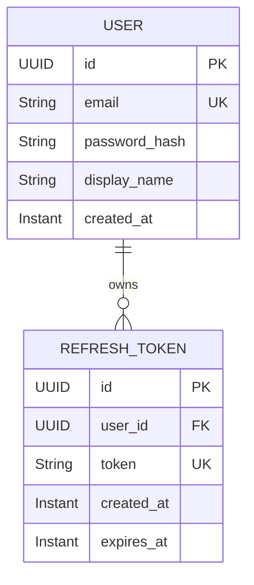
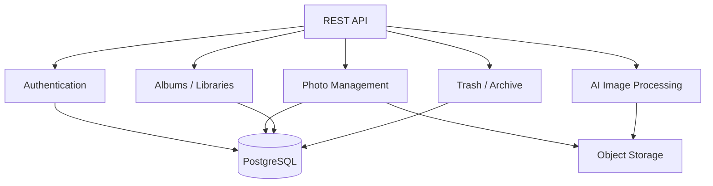

## 1. Overview

BinaryPixels is a Google Photos-inspired image management platform designed to allow users to store, organize, manage, and modify images using AI-powered features.

The application follows a layered backend architecture built around **Spring Boot**, **Spring Security**, **PostgreSQL**, and a frontend client communicating through REST APIs.

The backend is organized by responsibility rather than by individual feature, keeping HTTP handling, business logic, persistence, security, and configuration separated.

---

## 2. High-Level System Architecture



The general request path is:

```text
Frontend
   │
   ▼
Spring Boot API
   │
   ▼
Security Layer
   │
   ▼
Controller
   │
   ▼
Service
   │
   ▼
Repository
   │
   ▼
PostgreSQL
```

Security is applied before protected requests reach the application controllers.

---

# 3. Backend Package Structure

The backend currently follows this structure:

```text
com.binaryPixels.backend
│
├── config
│   ├── AppConfig
│   ├── CorsProperties
│   ├── JwtProperties
│   └── SecurityConfig
│
├── controller
│
├── domain
│   ├── User
│   └── RefreshToken
│
├── dto
│
├── exception
│
├── repository
│
├── security
│   └── JwtAuthenticationFilter
│
├── services
│   ├── JwtService
│   ├── UserService
│   └── implementation
│       └── UserDetailsServiceImpl
│
└── BackendApplication
```

The package structure is intentionally simple. The project is currently a modular monolith rather than a collection of independent services.

---

# 4. Layer Responsibilities

## `config`

Contains application-level configuration.

Responsibilities include:

- Spring Security configuration
    
- CORS configuration
    
- JWT configuration properties
    
- Application-specific configuration beans
    

### Important classes

|Class|Responsibility|
|---|---|
|`AppConfig`|Configures CORS and registers configuration properties|
|`CorsProperties`|Binds CORS configuration from application properties|
|`JwtProperties`|Binds JWT configuration from application properties|
|`SecurityConfig`|Defines Spring Security rules and authentication infrastructure|

---

## `controller`

The controller layer is responsible for HTTP communication.

Its responsibilities should remain limited to:

- Receiving HTTP requests
    
- Validating request-level input
    
- Calling services
    
- Returning HTTP responses
    

Controllers should **not** contain business logic or direct database operations.

Example:

```text
HTTP Request
     │
     ▼
Controller
     │
     ▼
Service
```

---

## `service`

The service layer contains application/business logic.

For example, authentication-related operations such as:

```text
Register User
      ↓
Validate User Data
      ↓
Hash Password
      ↓
Persist User
```

The service layer acts as the boundary between controllers and persistence.

---

## `repository`

Repositories are responsible for persistence operations.

The intended dependency direction is:

```text
Controller
    ↓
Service
    ↓
Repository
    ↓
PostgreSQL
```

Controllers should not directly interact with repositories.

This keeps persistence concerns isolated from the HTTP layer.

---

## `domain`

The domain package contains JPA entities representing persistent application data.

Current entities include:

```text
User
RefreshToken
```

### User

```text
User
├── id
├── email
├── passwordHash
├── displayName
└── createdAt
```

### RefreshToken

```text
RefreshToken
├── id
├── user
├── token
├── createdAt
└── expiresAt
```

---

## `dto`

DTOs represent data exchanged through the API.

They should prevent persistence entities from becoming the public API contract.

For example:

```text
HTTP Request
     │
     ▼
RegisterRequest DTO
     │
     ▼
UserService
     │
     ▼
User Entity
```

The entity and API request/response models therefore remain separate.

---

## `security`

The security package contains components responsible for request authentication.

The current authentication filter is:

```text
JwtAuthenticationFilter
```

It extends Spring Security's `OncePerRequestFilter`.

Its purpose is to inspect incoming requests for JWT authentication and establish the authenticated principal inside Spring Security.

---

## `exception`

The exception package is intended to centralize application-specific exception handling.

This keeps error handling separate from business logic and controllers.

The eventual request flow should look like:

```text
Exception
   │
   ▼
Global Exception Handler
   │
   ▼
Consistent API Error Response
```

---

# 5. Security Architecture

BinaryPixels uses a **stateless JWT-based authentication model**.



Spring Security is configured with:

```text
SessionCreationPolicy.STATELESS
```

Therefore authentication is not maintained through a traditional server-side HTTP session.

Each protected request carries its authentication information through a JWT.

---

# 6. Configuration Management

Application configuration is externalized through Spring Boot properties.

Current configuration groups include:

```properties
app.cors.*
app.jwt.*
```

These are mapped to:

```text
CorsProperties
JwtProperties
```

### CORS

```properties
app.cors.allowed-origins=http://localhost:3000
```

### JWT

```properties
app.jwt.access-expiration-ms=900000
app.jwt.refresh-expiration-ms=604800000
```

This keeps environment-specific configuration outside the Java implementation.

---

# 7. Database Architecture

The backend uses PostgreSQL.

The current persistence model contains the authentication entities:



A user can have multiple refresh tokens.

This allows the system to support multiple authenticated sessions/devices in the future.

---

# 8. Dependency Direction

The backend should maintain the following dependency direction:

```text
┌─────────────────────────┐
│       Controller        │
└────────────┬────────────┘
             │
             ▼
┌─────────────────────────┐
│        Service          │
└────────────┬────────────┘
             │
             ▼
┌─────────────────────────┐
│       Repository        │
└────────────┬────────────┘
             │
             ▼
┌─────────────────────────┐
│       PostgreSQL        │
└─────────────────────────┘
```

Security operates across the HTTP boundary:

```text
Client
  │
  ▼
Security
  │
  ▼
Controller
```

This separation prevents authentication, HTTP handling, business logic, and persistence from becoming tightly coupled.

---

# 9. Current Architectural Philosophy

BinaryPixels currently follows a **modular monolith** approach.

The application is deployed as one backend application, but its internal responsibilities are separated into modules/packages.

```text
                 BinaryPixels Backend
                         │
       ┌─────────────────┼─────────────────┐
       │                 │                 │
   Security           Business         Persistence
       │                 │                 │
       ▼                 ▼                 ▼
 JWT / Auth          Services          Repositories
                                         │
                                         ▼
                                     PostgreSQL
```

This is intentionally preferable to introducing microservices at the current project stage.

The system does not yet have the scale or operational requirements that would justify distributed services.

---

# 10. Architectural Principles

The current architecture follows these principles:

### Separation of Concerns

- Each layer has a defined responsibility.

### Stateless Authentication

- Authentication is based on JWTs rather than server-side sessions.

### Configuration Externalization

- Environment-specific configuration is kept outside Java classes.

### Persistence Isolation

- Database access is handled through repositories rather than controllers.

### DTO/Entity Separation

- API contracts should remain independent from database entities.

### Incremental Complexity

- The architecture is intentionally kept as a modular monolith until real requirements justify additional infrastructure.

---

# 11. Current Status

### Implemented

- Spring Boot application structure
    
- PostgreSQL configuration
    
- JPA configuration
    
- CORS configuration
    
- Spring Security configuration
    
- Stateless security configuration
    
- JWT properties
    
- JWT service
    
- User entity
    
- Refresh token entity
    
- JWT authentication filter foundation
    

### In Progress

- Authentication controllers
    
- Registration flow
    
- Login flow
    
- Refresh-token flow
    
- Authentication DTOs
    
- Repository layer
    
- Exception handling
    
- Photo domain model
    
- Image storage
    
- Album/library functionality
    
- Trash/archive functionality
    
- AI image modification pipeline
    

---

# 12. Future Architecture

As functionality grows, the backend is expected to evolve around the following conceptual modules:


