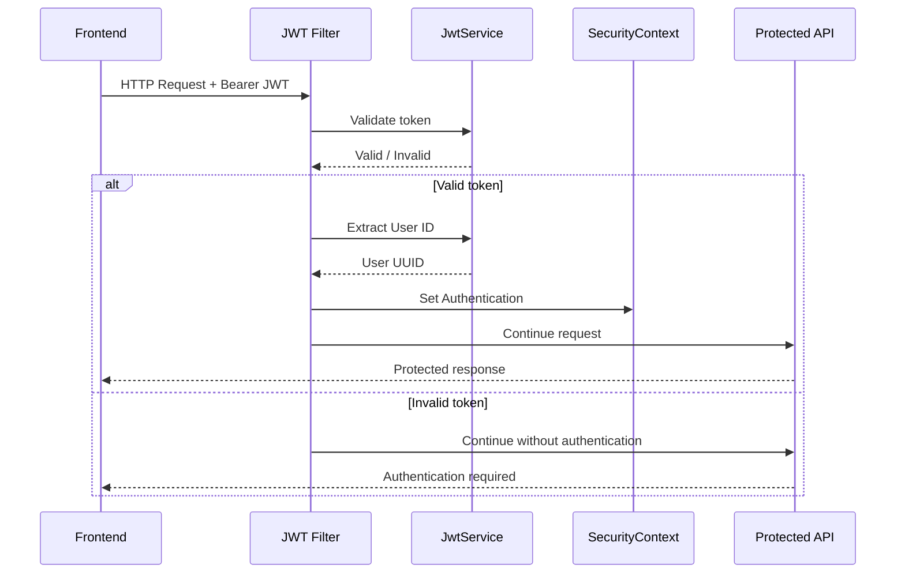
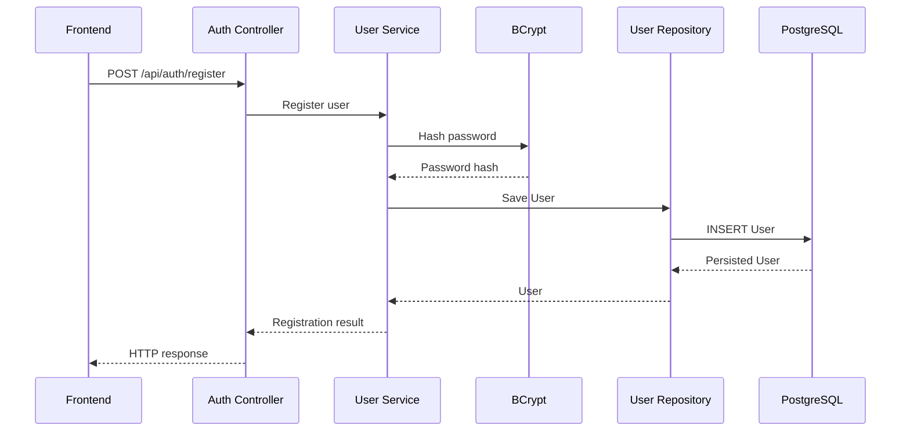
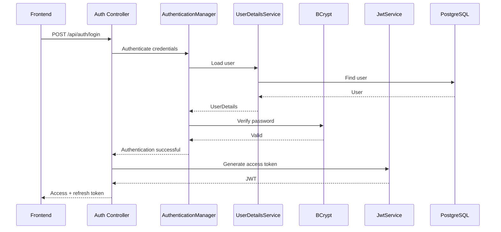
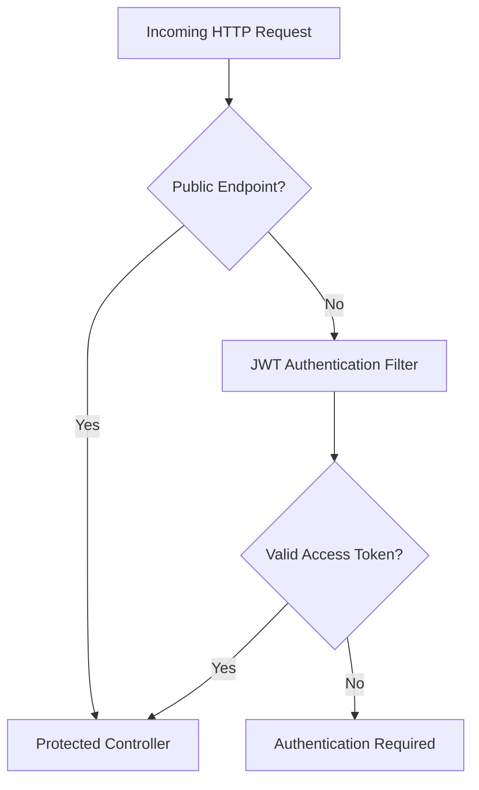
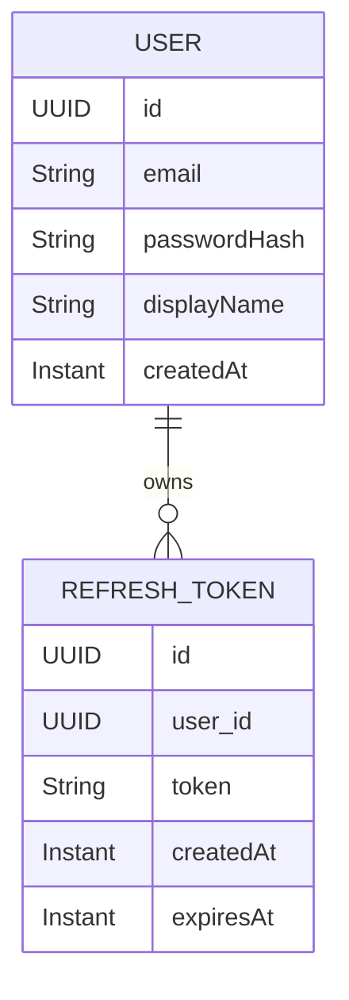
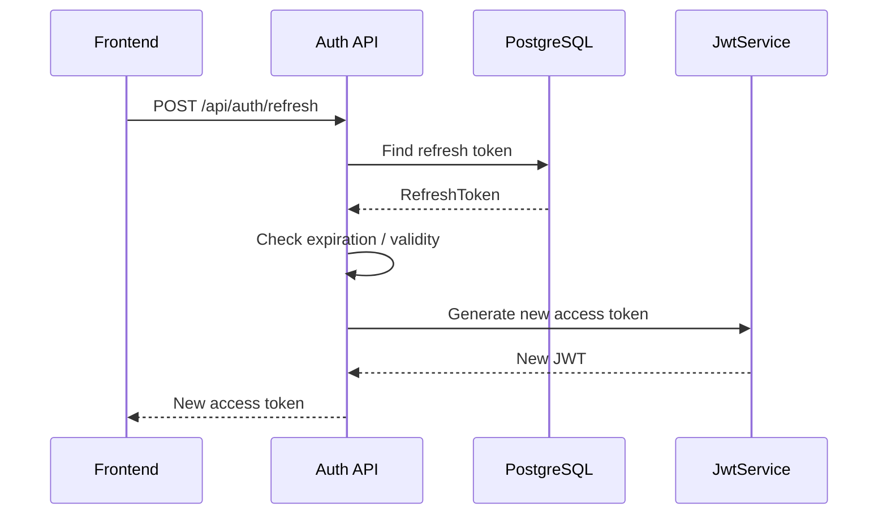
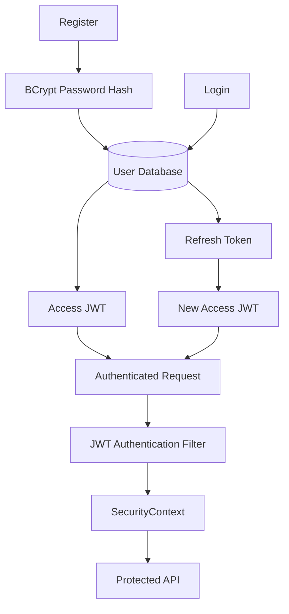

## 1. Overview

BinaryPixels uses **stateless JWT-based authentication** with Spring Security.

The authentication system is built around two token types:

```text
Access Token
    ↓
Short-lived JWT
    ↓
Used to authenticate API requests


Refresh Token
    ↓
Longer-lived persistent token
    ↓
Used to obtain a new access token
```

The current configuration defines:

```text
Access Token  → 15 minutes
Refresh Token → 7 days
```

The access token is implemented as a signed JWT, while refresh tokens are represented as persistent application entities.

---

# 2. Authentication Components

The current authentication architecture consists of:

```text
config/
├── JwtProperties
└── SecurityConfig

domain/
├── User
└── RefreshToken

security/
└── JwtAuthenticationFilter

services/
├── JwtService
└── UserService

services/implementation/
└── UserDetailsServiceImpl
```

Their responsibilities are:

|Component|Responsibility|
|---|---|
|`JwtProperties`|Provides JWT configuration|
|`SecurityConfig`|Defines Spring Security policies|
|`JwtService`|Creates and validates JWTs|
|`JwtAuthenticationFilter`|Extracts JWTs from HTTP requests|
|`UserService`|Handles user-related operations|
|`UserDetailsServiceImpl`|Adapts application users to Spring Security|
|`User`|Stores user identity data|
|`RefreshToken`|Stores persistent refresh tokens|

---

# 3. Authentication Model

The authentication model is stateless.



The important idea is:

> The JWT does not itself grant access to an endpoint. It is used to establish an authenticated principal inside Spring Security.

---

# 4. Registration Flow

The intended registration flow is:



The `User` entity stores:

```text
id
email
passwordHash
displayName
createdAt
```

The raw password should never be persisted.

---

# 5. Password Storage

Passwords are handled using Spring Security's `PasswordEncoder`.

The current security configuration exposes:

```java
@Bean
PasswordEncoder passwordEncoder() {
    return new BCryptPasswordEncoder();
}
```

Therefore the intended process is:

```text
Raw Password
     │
     ▼
BCrypt
     │
     ▼
Password Hash
     │
     ▼
PostgreSQL
```

The database stores the hash rather than the original password.

For authentication, the submitted password is compared against the stored BCrypt hash.

---

# 6. Login Flow

The intended login flow is:



The exact controller implementation is not part of the current code supplied for this documentation, so this represents the intended authentication flow rather than an already completed endpoint implementation.

---

# 7. Access Token

The access token is a signed JWT generated by `JwtService`.

The token contains claims conceptually equivalent to:

```text
{
    "sub": "<user-uuid>",
    "email": "<user-email>",
    "type": "access",
    "iat": "<issued-at>",
    "exp": "<expiration>"
}
```

The subject contains the user's UUID.

The `type` claim distinguishes an access token from other token types.

The token is cryptographically signed using the configured secret key.

---

# 8. Access Token Lifetime

The current configuration is:

```properties
app.jwt.access-expiration-ms=900000
```

which equals:

```text
900,000 ms
     ↓
900 seconds
     ↓
15 minutes
```

The short lifetime limits the amount of time an exposed access token remains usable.

---

# 9. JWT Validation

`JwtService.isValidToken()` performs the basic validation required by the current implementation.

Conceptually:

```text
JWT
 │
 ├── Can it be parsed?
 │
 ├── Is the signature valid?
 │
 ├── Has the token expired?
 │
 └── Is token type == "access"?
 │
 ▼
Valid / Invalid
```

The JWT parser verifies the token against the configured `SecretKey`.

If parsing or validation fails, the token is considered invalid.

---

# 10. JWT Authentication Filter

`JwtAuthenticationFilter` extends:

```java
OncePerRequestFilter
```

This allows the application to inspect each HTTP request before it reaches protected endpoints.

The intended algorithm is:

```text
HTTP Request
     │
     ▼
Read Authorization header
     │
     ▼
Starts with "Bearer "?
     │
    Yes
     │
     ▼
Extract JWT
     │
     ▼
Validate JWT
     │
     ▼
Extract User UUID
     │
     ▼
Find User
     │
     ▼
Load UserDetails
     │
     ▼
Create Authentication
     │
     ▼
SecurityContext
     │
     ▼
Continue request
```

---

# 11. Bearer Token

The frontend sends the access token using the HTTP `Authorization` header:

```http
Authorization: Bearer <access-token>
```

The filter extracts everything after:

```text
Bearer 
```

and passes the JWT to `JwtService`.

---

# 12. SecurityContext

After successful validation, the filter creates:

```java
UsernamePasswordAuthenticationToken
```

using the loaded `UserDetails`.

The authentication object is then placed into:

```java
SecurityContextHolder
```

Conceptually:

```text
JWT
 │
 ▼
Validated User
 │
 ▼
Authentication Object
 │
 ▼
SecurityContext
 │
 ▼
Spring Security considers request authenticated
```

This is the mechanism that connects JWT authentication with Spring Security's authorization system.

---

# 13. Security Configuration

`SecurityConfig` defines the application's HTTP security policy.

The application uses:

```java
SessionCreationPolicy.STATELESS
```

Therefore Spring Security does not maintain authentication through a traditional HTTP session.

---

## Public Endpoints

The following authentication endpoints are configured as publicly accessible:

```text
POST /api/auth/register
POST /api/auth/login
POST /api/auth/refresh
```

The health endpoint is also public:

```text
GET /actuator/health
```

CORS preflight requests are permitted:

```text
OPTIONS
```

Everything else requires authentication:

```text
.anyRequest().authenticated()
```

---

# 14. Request Authorization

The resulting authorization model is:



The filter establishes authentication, while Spring Security's authorization configuration determines whether the endpoint can be accessed.

---

# 15. Refresh Tokens

Refresh tokens are represented by the `RefreshToken` JPA entity.

```text
RefreshToken
├── id
├── user
├── token
├── createdAt
└── expiresAt
```

The entity has a many-to-one relationship with `User`.



This means one user can have multiple refresh tokens.

That model can later support multiple active sessions/devices.

---

# 16. Refresh Token Lifetime

The configured lifetime is:

```properties
app.jwt.refresh-expiration-ms=604800000
```

which equals:

```text
604,800,000 ms
        ↓
604,800 seconds
        ↓
10,080 minutes
        ↓
168 hours
        ↓
7 days
```

The refresh-token expiration must use `refreshExpirationMs`, not `accessExpirationMs`.

---

# 17. Refresh Flow

The intended refresh flow is:



The exact controller and repository implementation are still part of the authentication work in progress.

---

# 18. Why Access and Refresh Tokens Are Different

The two tokens serve different purposes.

```text
                Authentication
                     │
          ┌──────────┴──────────┐
          │                     │
          ▼                     ▼
    Access Token          Refresh Token
          │                     │
      JWT-based             Persistent
          │                     │
     Short-lived             Longer-lived
          │                     │
     API requests        Obtain new access
```

### Access Token

Optimized for frequent API authentication.

### Refresh Token

Optimized for maintaining a longer-lived login without making the access token itself long-lived.

---

# 19. Secret-Key Handling

`JwtService` converts the configured JWT secret into a `SecretKey`.

The key is used for signing and verifying JWTs.

```text
Configured Secret
       │
       ▼
SecretKey
       │
 ┌─────┴─────┐
 ▼           ▼
Signing   Verification
```

The production deployment should provide the secret through an environment variable rather than committing a real secret to source control.

Example:

```properties
app.jwt.secret=${JWT_SECRET}
```

The current local configuration contains a development fallback. This should not be treated as a production secret.

---

# 20. Authentication Data Model

The current identity model is:

```text
                    User
                     │
          ┌──────────┴──────────┐
          │                     │
          ▼                     ▼
   Authentication          Refresh Tokens
          │                     │
          ▼                     ▼
 Password Hash              Persistent
          │                   Tokens
          │
          ▼
      UserDetails
          │
          ▼
  Spring Security
```

The application therefore separates:

- User identity
    
- Password storage
    
- Access-token authentication
    
- Refresh-token persistence
    
- Spring Security authorization state
    

---

# 21. Security Boundaries

The current architecture follows these boundaries:

```text
                 HTTP
                  │
                  ▼
        ┌──────────────────┐
        │ Security Filter  │
        └────────┬─────────┘
                 │
          Authentication
                 │
                 ▼
        ┌──────────────────┐
        │   Controller     │
        └────────┬─────────┘
                 │
             Business
               Logic
                 │
                 ▼
        ┌──────────────────┐
        │     Service      │
        └────────┬─────────┘
                 │
            Persistence
                 │
                 ▼
        ┌──────────────────┐
        │   PostgreSQL     │
        └──────────────────┘
```

Each layer has a distinct responsibility.

---

# 22. Current Implementation Status

## Implemented

- JWT configuration properties
    
- JWT access-token generation
    
- JWT signature verification
    
- JWT expiration validation
    
- Access-token type validation
    
- Stateless Spring Security configuration
    
- BCrypt password encoder
    
- JWT authentication filter foundation
    
- `User` entity
    
- `RefreshToken` entity
    
- CORS configuration
    
- Authentication-related service structure
    

## In Progress

- Registration endpoint
    
- Login endpoint
    
- Refresh endpoint
    
- Refresh-token repository
    
- Authentication DTOs
    
- Complete authentication integration testing
    
- Logout/revocation behavior
    

---

# 23. Known Implementation Notes

Before considering the authentication subsystem complete, the following implementation details must be verified:

### JWT Filter

The Bearer-token condition must ensure that requests **without** a Bearer token bypass JWT extraction safely.

Expected logic:

```java
if (authHeader == null || !authHeader.startsWith("Bearer ")) {
    filterChain.doFilter(request, response);
    return;
}

String jwt = authHeader.substring(7);
```

### Refresh Expiration

Refresh-token expiration must use:

```java
jwtProperties.refreshExpirationMs()
```

rather than:

```java
jwtProperties.accessExpirationMs()
```

### Refresh Token Foreign Key

The refresh-token relationship should use a conventional database foreign-key column such as:

```text
user_id
```

These are implementation correctness requirements before the authentication subsystem should be considered complete.

---

# 24. End-to-End Authentication Model

The complete intended model is:



The fundamental lifecycle is:

```text
REGISTER
   ↓
USER CREATED
   ↓
LOGIN
   ↓
ACCESS JWT + REFRESH TOKEN
   ↓
AUTHENTICATED API REQUESTS
   ↓
ACCESS TOKEN EXPIRES
   ↓
REFRESH TOKEN
   ↓
NEW ACCESS JWT
```

This forms the authentication foundation on which the remaining BinaryPixels functionality can be built.